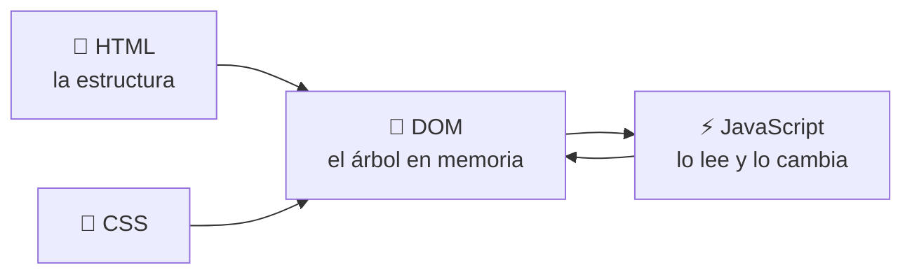

# HTML, CSS y JavaScript

Una página web son tres lenguajes con tres funciones, y mantenerlos separados
es la mayor parte de lo que significa "bien construida":

| | Es | Vive en |
| --- | --- | --- |
| **HTML** | el contenido y su estructura | `index.html` |
| **CSS** | la apariencia | `style.css` |
| **JavaScript** | el comportamiento | `app.js` |

Tres archivos, tres asuntos. Los atributos `style="…"` en línea y los
manejadores `onclick="…"` funcionan, y son la forma en que una página se vuelve
imposible de mantener para la tercera semana.

---

## La página más pequeña que funciona

```html
<!DOCTYPE html>
<html lang="es">
  <head>
    <meta charset="utf-8" />
    <meta name="viewport" content="width=device-width, initial-scale=1" />
    <title>Mi juego</title>
    <link rel="stylesheet" href="style.css" />
  </head>
  <body>
    <h1>Mi juego</h1>
    <div id="board"></div>
    <button id="new-game">Nueva partida</button>

    <script src="app.js"></script>
  </body>
</html>
```

Tres detalles de ahí no son decoración:

- **`<meta name="viewport">`** es lo que hace que la página se pueda usar en un
  móvil. Sin él, un navegador móvil renderiza a anchura de escritorio y lo
  reduce.
- **Los atributos `id`** son los asideros que usa JavaScript. Dale uno a todo
  lo que el script necesite encontrar.
- **`<script>` al final de `<body>`** se ejecuta después de que existan los
  elementos de arriba. Un script en `<head>` se ejecuta primero y no encuentra
  nada.

---

## El DOM, en cuatro llamadas

El navegador convierte tu HTML en un árbol de objetos —el **DOM**— que JavaScript
puede leer y modificar. Ese es todo el ciclo de una página estática:



El **DOM** es el modelo de objetos vivo que el navegador tiene de la página.
Cambiarlo cambia lo que hay en pantalla, de inmediato. No necesitas casi nada
de su superficie:

```js
const board = document.getElementById("board");        // encuentra un elemento
const cells = document.querySelectorAll(".stick");     // varios, por selector CSS

board.textContent = "3 5 7";                           // escribe texto, con seguridad
board.classList.toggle("hidden", isOver);              // añade/quita una clase

document.getElementById("new-game")
        .addEventListener("click", () => newGame());   // reacciona a algo
```

`textContent` en vez de `innerHTML` es una costumbre que conviene coger:
`textContent` escribe texto, `innerHTML` interpreta marcado, y lo segundo
convierte cualquier cadena que no hayas escrito tú en una forma de inyectar
HTML en tu página. Cuando de verdad necesites marcado, escapa las partes que
vengan de datos — este repositorio guarda un `esc()` de cuatro líneas en
[`web/js/core.js`](https://github.com/jparisu/nim-arena/blob/main/web/js/core.js)
y lo usa en cada valor interpolado.

**Construye elementos, no concatenes cadenas.** Un ayudante pequeño se amortiza
en una hora:

```js
const el = (tag, cls, txt) => {
  const e = document.createElement(tag);
  if (cls) e.className = cls;
  if (txt != null) e.textContent = txt;
  return e;
};
```

---

## Cargar datos sin backend

Una página estática no puede consultar una base de datos, pero sí puede leer un
archivo que esté a su lado:

```js
async function loadScoreboard() {
  const resp = await fetch("leaderboard.json", { cache: "no-cache" });
  if (!resp.ok) throw new Error(`leaderboard.json → HTTP ${resp.status}`);
  return resp.json();
}
```

Ese es todo el mecanismo detrás del marcador de este proyecto: un
[workflow programado](../../github/actions.md) ejecuta el torneo, hace commit
de `leaderboard.json`, y la página lo descarga. Solo lectura, versionado,
gratis y sin servidor de por medio.

`{ cache: "no-cache" }` importa más de lo que parece. Sin eso, un navegador te
servirá tan tranquilo la copia de ayer de un archivo que un workflow actualizó
hace una hora, y te vas a pasar una tarde depurando un torneo que se ejecutó
perfectamente.

!!! warning "Todo lo que envías es público"
    No hay una mitad privada en un sitio estático. Tu JavaScript, tu JSON y
    cualquier cosa incrustada en ellos los puede leer cualquier visitante con
    las herramientas de desarrollo abiertas. Nunca pongas un token, una
    contraseña o una solución en un archivo que el navegador descarga. Si
    necesitas un secreto, necesitas un servidor — mira
    [Alojamiento](../hosting.md).

---

## Que siga siendo legible según crece

Sin framework. React, Vue y Svelte son buenas herramientas que quieren todas un
paso de compilación, un `node_modules` y una segunda cadena de herramientas en
un proyecto cuyo lenguaje real es Python. Para la interfaz de un juego, los
archivos planos bastan, y siguen bastando con mil líneas si los repartes.

La página de este repositorio tiene unas 2.500 líneas y ningún paso de
compilación para el JavaScript. Lo que la mantiene legible:

**Un archivo por pantalla.**
[`web/js/`](https://github.com/jparisu/nim-arena/tree/main/web/js) contiene
`core.js` (los ayudantes que usa todo), luego `play.js`, `scoreboard.js` y
`tournament.js` —una pantalla cada uno— y `main.js`, que arranca y conecta.

**Fragmentos de HTML.** El marcado de cada pantalla es su propio archivo bajo
`web/screens/`, descargado e insertado al arrancar:

```js
const parts = await Promise.all(
  SCREENS.map(async (name) => {
    const resp = await fetch(`screens/${name}.html`, { cache: "no-cache" });
    if (!resp.ok) throw new Error(`screens/${name}.html → HTTP ${resp.status}`);
    return resp.text();
  }),
);
host.innerHTML = parts.join("\n");
```

Cinco pantallas en un `index.html` es un archivo que nadie puede editar. Cinco
archivos, insertados en una página, son cinco archivos — y sigue siendo una
sola página, así que el motor de Python arranca una vez en lugar de una por
pestaña.

**Un único renderizador.** El tablero lo dibuja un solo
`paintBoard(container, state, {onPick})` en `core.js`, al que llaman tanto la
pantalla de juego como la de torneo. Dos copias de un renderizador divergen;
una copia no puede.

---

## Fallar en voz alta

Una página estática no tiene log de servidor. Cuando algo lanza una excepción,
el resultado por defecto es un botón que no hace nada y una persona que no
tiene ni idea de por qué — el informe de error menos depurable que existe.

Dos costumbres lo arreglan, y las dos están en el
[`main.js`](https://github.com/jparisu/nim-arena/blob/main/web/js/main.js) de
este repositorio:

```js
// 1. Nada se escapa en silencio.
window.addEventListener("error", (e) => showFatal("Unexpected error", e.error));
window.addEventListener("unhandledrejection", (e) => showFatal("Unexpected error", e.reason));

// 2. Un paso roto no puede desarmar a los demás.
function step(label, fn) {
  try { fn(); return true; }
  catch (err) { showFatal(`Could not set up ${label}`, err); return false; }
}
```

La segunda es la victoria más sutil. Conectar todos los manejadores en una sola
línea recta significa que una excepción a mitad de camino deja los botones
*posteriores* sin manejador alguno — y esos botones fallan luego de una forma
que no apunta ni de lejos a la causa.

---

## Ejecutarla en local

Sirve la carpeta. No abras el archivo.

```console
$ python -m http.server -d web 8000
# y abre http://localhost:8000
```

Hacer doble clic en `index.html` te da una URL `file://`, y en `file://` el
navegador bloquea `fetch()` por seguridad. Tu página cargará, se verá
correcta, y fallará en silencio al leer cualquiera de sus datos — un fallo
confuso con un arreglo de una línea.

---

**Siguiente:** [Python en el navegador](pyodide.md) — ejecutar tu paquete en el cliente, para no escribir las reglas dos veces.

**También:** [GitHub Pages](../../github/pages.md) · [La página web](../../../game/advanced/web.md)
