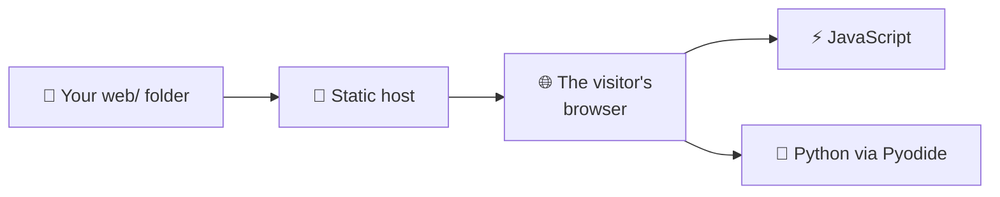

# Static web

A **static** site is a folder of files — HTML, CSS, JavaScript, images, JSON —
that a host hands out unchanged. Nothing runs on the server, because there is no
server to speak of.

That sounds limiting until you notice how much fits inside it. Everything
interactive still works; it just runs in the visitor's browser instead. This
repository's own game page is static, and it runs the project's **real Python**
through [Pyodide](pyodide.md).

---

## What a static host serves

The server only hands out files. Everything that *does* something runs on the
other side, in the browser.

---

## The pages

- :material-language-html5:{ .lg .middle } **[HTML, CSS and JavaScript](html-js.md)**

    ---

    The three files a web page is made of, and the least you need to know about
    each.

- :material-language-python:{ .lg .middle } **[Python in the browser](pyodide.md)**

    ---

    Running your own package client-side with Pyodide, so the logic is never
    written twice.

---

## Publishing it

A static site needs a static host, and the one attached to your repository is
free: **[GitHub Pages](../../github/pages.md)**. That page covers the
`gh-pages` branch, the deploy workflow and the published URL.

---

**Next:** [GitHub Pages](../../github/pages.md) — publishing this, for free.

**Also:** [Streamlit](../streamlit/index.md) · [The web app](../../../game/advanced/web.md)
