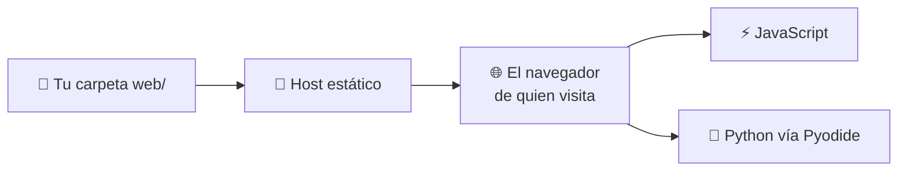

# Web estática

Un sitio **estático** es una carpeta de archivos — HTML, CSS, JavaScript,
imágenes, JSON — que un host reparte sin tocarlos. No se ejecuta nada en el
servidor, porque prácticamente no hay servidor.

Suena limitado hasta que te fijas en cuánto cabe ahí dentro. Todo lo interactivo
sigue funcionando; simplemente se ejecuta en el navegador de quien visita. La
página del juego de este repositorio es estática, y ejecuta el **Python real**
del proyecto mediante [Pyodide](pyodide.md).

---

## Qué sirve un host estático

El servidor solo reparte archivos. Todo lo que *hace* algo se ejecuta al otro
lado, en el navegador.

---

## Las páginas

- :material-language-html5:{ .lg .middle } **[HTML, CSS y JavaScript](html-js.md)**

    ---

    Los tres archivos de los que se compone una página web, y lo mínimo que hay
    que saber de cada uno.

- :material-language-python:{ .lg .middle } **[Python en el navegador](pyodide.md)**

    ---

    Ejecutar tu propio paquete en el cliente con Pyodide, para no escribir la
    lógica dos veces.

---

## Publicarla

Un sitio estático necesita un host estático, y el que viene con tu repositorio es
gratis: **[GitHub Pages](../../github/pages.md)**. Esa página cubre la rama
`gh-pages`, el flujo de despliegue y la URL publicada.

---

**Siguiente:** [GitHub Pages](../../github/pages.md) — publicar esto, gratis.

**También:** [Streamlit](../streamlit/index.md) · [La página web](../../../game/advanced/web.md)
