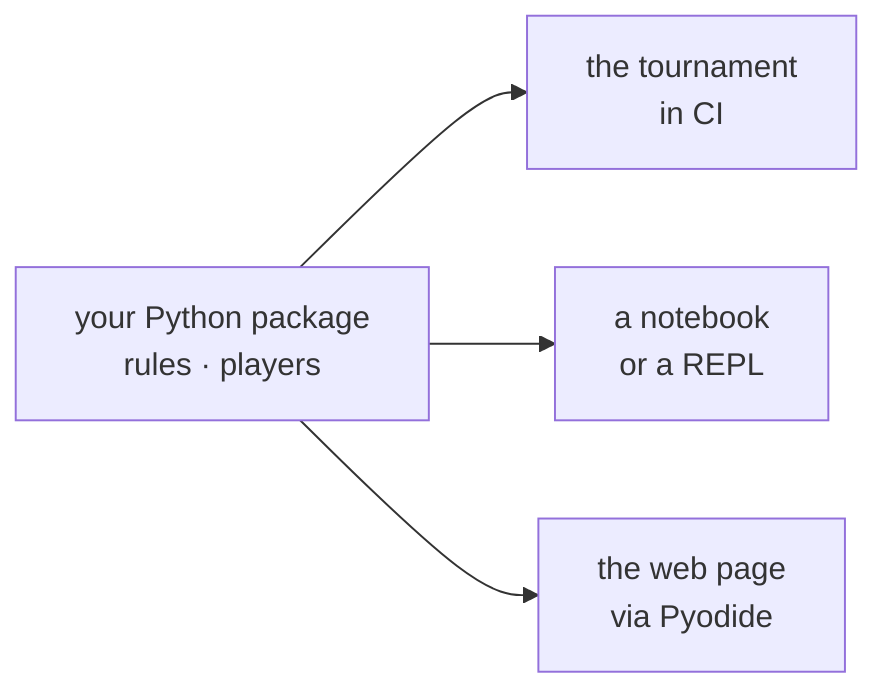

# Python in the browser

[Pyodide](https://pyodide.org) is CPython compiled to WebAssembly. You load it
from a CDN, and from then on there is a real Python interpreter running inside
the browser tab — with the standard library, and with the ability to import your
own package.

For a project whose logic is already in Python, this is the feature that makes
the whole static route work.

## Why it matters

Without it, a static page that plays your game needs the rules **in
JavaScript**. That is a second implementation of the thing you are being
assessed on, and second implementations drift. You fix an edge case in the
Python engine, the tournament picks it up, the web page does not, and now the
page and the tournament disagree about whether a move is legal.

With Pyodide there is one engine.



!!! quote "One source of truth"
    This repository's page runs the same `nimarena` package as the graded
    tournament. The rules are **never** re-implemented in JavaScript. See
    [The web app](../../../game/advanced/web.md).

## Loading it

```js
const VERSION = "0.26.2";
const CDN = `https://cdn.jsdelivr.net/pyodide/v${VERSION}/full/`;

// The loader script defines the global `loadPyodide`.
await new Promise((resolve, reject) => {
  const s = document.createElement("script");
  s.src = `${CDN}pyodide.js`;
  s.onload = resolve;
  s.onerror = () => reject(new Error("Failed to load Pyodide from the CDN"));
  document.head.appendChild(s);
});

const pyodide = await loadPyodide({ indexURL: CDN });
```

Pin the version. `full/` without a version follows whatever is current, and an
upstream release then breaks your page on a day you did not touch it.

Third-party packages that Pyodide ships are one call away:

```js
await pyodide.loadPackage("pyyaml");
```

Anything pure-Python that it does not ship can be installed at runtime with
`micropip`. Anything with compiled C extensions cannot, unless Pyodide has built
it — which rules out most of the scientific stack's less common corners. Check
before you depend on a library.

## Getting your own package in

Your package is not on any CDN, so you ship it yourself. The pattern: **zip the
source at build time, fetch and unpack it at load time.**

A build script assembles the archive:

```python
with zipfile.ZipFile(WEB / "py.zip", "w", zipfile.ZIP_DEFLATED) as zf:
    for path in sorted(STAGE.rglob("*")):
        if path.is_file():
            zf.write(path, path.relative_to(STAGE))
```

and the page unpacks it into Pyodide's in-memory filesystem and puts it on the
import path:

```js
const MOUNT = "/lib/nimsite";

const resp = await fetch("py.zip", { cache: "no-cache" });
if (!resp.ok) {
  throw new Error("Could not fetch py.zip. Run `python scripts/build_web.py` first.");
}
pyodide.FS.mkdirTree(MOUNT);
await pyodide.unpackArchive(await resp.arrayBuffer(), "zip", { extractDir: MOUNT });
pyodide.runPython(`import sys; sys.path.insert(0, "${MOUNT}")`);
```

This repository's [`scripts/build_web.py`](https://github.com/jparisu/nim-arena/blob/main/scripts/build_web.py)
does exactly that, bundling `src/nimarena/`, the whole `players/` tree and the
bridge module into `web/py.zip`. The
[Pages workflow](../../github/actions.md) runs the same script before
deploying, so the published archive is always built from the committed source.

!!! tip "Generated files do not belong in Git"
    `web/py.zip` is build output. Committing it makes every rebuild a diff and
    every merge a conflict — `.gitignore` it and let the build produce it. See
    [Commands](../../git/commands.md#the-gitignore-file).

## The bridge

Do not call into your package from JavaScript directly. Write **one Python
module** that exposes exactly the functions the page needs, and let JavaScript
talk only to that.

```python
"""Thin bridge exposed to the browser."""
import json
from nimarena import game

def legal_moves(state_json: str) -> str:
    return json.dumps(game.legal_moves(json.loads(state_json)))

def apply_move(state_json: str, move_json: str) -> str:
    return json.dumps(game.apply_move(json.loads(state_json), json.loads(move_json)))
```

```js
const webglue = pyodide.pyimport("webglue");

window.NIM = {
  legalMoves: (state) => JSON.parse(webglue.legal_moves(JSON.stringify(state))),
  applyMove: (state, move) =>
    JSON.parse(webglue.apply_move(JSON.stringify(state), JSON.stringify(move))),
};
```

Two rules make this boundary survive contact with a real project:

**Everything crosses as a JSON string.** Pyodide will happily proxy live Python
objects into JavaScript, and it is a trap: you get objects that must be
explicitly destroyed, that behave almost-but-not-quite like JavaScript objects,
and that leak. `json.dumps` on one side and `JSON.parse` on the other is dumb,
debuggable and fast enough for a board game.

**The bridge is the only public surface.** One module, a handful of functions,
each taking and returning strings. When the page needs something new, you add a
function to the bridge rather than reaching deeper into the package from
JavaScript.

## What the user pays for

Pyodide is roughly 10 MB before your own code. On a first visit that is a real
wait — a few seconds on a good connection, longer on a phone.

You cannot remove the cost, so surface it:

```js
onStatus("Loading Pyodide…");
onStatus("Fetching the Python code…");
onStatus("Mounting the game engine…");
onStatus("Ready.");
```

A progress message is the difference between "it is loading" and "it is
broken". This repository shows a boot overlay with the current step, and hides
it only once the engine answers. A blank page for eight seconds reads as a
failure to everybody who has not seen it before.

The second visit is fast: the browser caches the CDN files.

## Limits

| No | Consequence |
| --- | --- |
| **Threads** | no `threading`, no parallel search |
| **Sockets** | no `requests`, no `socket`; use JavaScript's `fetch` |
| **A real filesystem** | `open()` works, but on an in-memory FS that dies with the tab |
| **Signals** | no `signal.alarm`, so **no timeout on a runaway bot** |
| **Subprocesses** | no `multiprocessing`, no `subprocess` |

The timeout one deserves a sentence. On a server you can cap a bot's thinking
time; in the browser you cannot interrupt it, and a bot stuck in a loop freezes
the tab. Python running in Pyodide blocks the same single thread that redraws
the page, so a five-second search is a five-second frozen interface.

Two practical responses, and this repository takes the first:

- **Accept it.** Live play is best-effort; enforcement belongs to the
  tournament, which runs in CI where timeouts are real. This is the honest
  choice for a student project.
- **Move Python to a Web Worker.** Correct, and a significant amount of extra
  machinery for a game that answers in milliseconds.

!!! warning "Test a bot in the browser before you trust it"
    A bot that is merely slow is invisible in a unit test and obvious on the
    page. If a move takes longer than about a second, the interface will feel
    broken even though nothing is wrong.

## Where to go next

- [HTML, CSS and JavaScript](html-js.md) — the page that calls the bridge.
- [GitHub Pages](../../github/pages.md) — publishing the result.
- [The web app](../../../game/advanced/web.md) — this repository doing all of
  this, documented in full.
