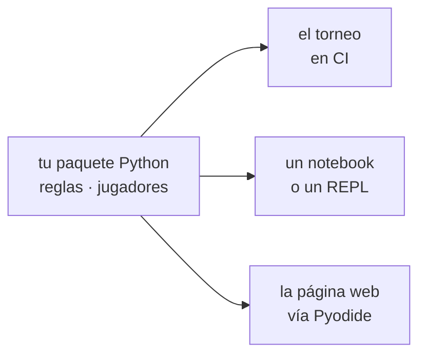

# Python en el navegador

[Pyodide](https://pyodide.org) es CPython compilado a WebAssembly. Lo cargas
desde una CDN y, a partir de ahí, hay un intérprete de Python real ejecutándose
dentro de la pestaña del navegador — con la librería estándar, y con la
capacidad de importar tu propio paquete.

Para un proyecto cuya lógica ya está en Python, esta es la característica que
hace que toda la ruta estática funcione.

---

## Por qué importa

Sin ella, una página estática que juegue a tu juego necesita las reglas **en
JavaScript**. Eso es una segunda implementación de justo aquello por lo que te
evalúan, y las segundas implementaciones se desvían. Arreglas un caso límite en
el motor de Python, el torneo lo recoge, la página web no, y ahora la página y
el torneo no se ponen de acuerdo en si un movimiento es legal.

Con Pyodide hay un solo motor.



!!! quote "Una sola fuente de verdad"
    La página de este repositorio ejecuta el mismo paquete `nimarena` que el
    torneo. Las reglas **nunca** se reimplementan en JavaScript. Mira
    [La página web](../../../game/advanced/web.md).

---

## Cargarlo

```js
const VERSION = "0.26.2";
const CDN = `https://cdn.jsdelivr.net/pyodide/v${VERSION}/full/`;

// El script cargador define el global `loadPyodide`.
await new Promise((resolve, reject) => {
  const s = document.createElement("script");
  s.src = `${CDN}pyodide.js`;
  s.onload = resolve;
  s.onerror = () => reject(new Error("Failed to load Pyodide from the CDN"));
  document.head.appendChild(s);
});

const pyodide = await loadPyodide({ indexURL: CDN });
```

Fija la versión. `full/` sin versión sigue a la que sea actual, y una
publicación río arriba te rompe la página un día en el que no la tocaste.

Los paquetes de terceros que Pyodide incluye están a una llamada:

```js
await pyodide.loadPackage("pyyaml");
```

Cualquier cosa de Python puro que no incluya se puede instalar en tiempo de
ejecución con `micropip`. Cualquier cosa con extensiones en C no se puede, a
menos que Pyodide la haya construido — lo que descarta buena parte de los
rincones menos comunes del ecosistema científico. Compruébalo antes de depender
de una librería.

---

## Meter tu propio paquete

Tu paquete no está en ninguna CDN, así que lo envías tú. El patrón: **comprime
el código al construir, descárgalo y descomprímelo al cargar.**

Un script de construcción monta el archivo:

```python
with zipfile.ZipFile(WEB / "py.zip", "w", zipfile.ZIP_DEFLATED) as zf:
    for path in sorted(STAGE.rglob("*")):
        if path.is_file():
            zf.write(path, path.relative_to(STAGE))
```

y la página lo descomprime en el sistema de archivos en memoria de Pyodide y lo
pone en la ruta de importación:

```js
const MOUNT = "/lib/nimsite";

const resp = await fetch("py.zip", { cache: "no-cache" });
if (!resp.ok) {
  throw new Error("Could not fetch py.zip. Run `python scripts/build_web.py` first.");
}
pyodide.FS.mkdirTree(MOUNT);
await pyodide.unpackArchive(await resp.arrayBuffer(), "zip", { extractDir: MOUNT });
pyodide.runPython(`import sys; sys.path.insert(0, "${MOUNT}")`);
```

El [`scripts/build_web.py`](https://github.com/jparisu/nim-arena/blob/main/scripts/build_web.py)
de este repositorio hace exactamente eso, empaquetando `src/nimarena/`, el árbol
`players/` entero y el módulo puente en `web/py.zip`. El
[workflow de Pages](../../github/actions.md) ejecuta el mismo script antes de
desplegar, así que el archivo publicado siempre se construye desde el código
commiteado.

!!! tip "Los archivos generados no van en Git"
    `web/py.zip` es salida de la construcción. Commitearlo convierte cada
    reconstrucción en un diff y cada merge en un conflicto: ponlo en
    `.gitignore` y deja que lo produzca la construcción. Mira
    [Comandos](../../git/commands.md#el-archivo-gitignore).

---

## El puente

No llames a tu paquete desde JavaScript directamente. Escribe **un módulo de
Python** que exponga exactamente las funciones que la página necesita, y que
JavaScript hable solo con él.

```python
"""Puente fino expuesto al navegador."""
import json
from nimarena import game

def legal_moves(state_json: str) -> str:
    return json.dumps(game.legal_moves(json.loads(state_json)))

def apply_move(state_json: str, move_json: str) -> str:
    return json.dumps(game.apply_move(json.loads(state_json), json.loads(move_json)))
```

```js
const webglue = pyodide.pyimport("webglue");

window.NIM = {
  legalMoves: (state) => JSON.parse(webglue.legal_moves(JSON.stringify(state))),
  applyMove: (state, move) =>
    JSON.parse(webglue.apply_move(JSON.stringify(state), JSON.stringify(move))),
};
```

Dos reglas hacen que esta frontera sobreviva al contacto con un proyecto real:

**Todo cruza como una cadena JSON.** Pyodide te pasará encantado objetos
Python vivos a JavaScript, y es una trampa: obtienes objetos que hay que
destruir explícitamente, que se comportan casi —pero no del todo— como objetos
de JavaScript, y que tienen fugas. `json.dumps` de un lado y `JSON.parse` del
otro es tonto, depurable y suficientemente rápido para un juego de mesa.

**El puente es la única superficie pública.** Un módulo, un puñado de
funciones, cada una recibiendo y devolviendo cadenas. Cuando la página necesite
algo nuevo, añades una función al puente en lugar de meter la mano más adentro
del paquete desde JavaScript.

---

## Lo que paga quien visita

Pyodide ocupa unos 10 MB antes de tu propio código. En una primera visita eso
es una espera real: unos segundos con buena conexión, más en un móvil.

No puedes quitar el coste, así que hazlo visible:

```js
onStatus("Loading Pyodide…");
onStatus("Fetching the Python code…");
onStatus("Mounting the game engine…");
onStatus("Ready.");
```

Un mensaje de progreso es la diferencia entre "está cargando" y "está roto".
Este repositorio enseña una pantalla de arranque con el paso actual y solo la
oculta cuando el motor responde. Una página en blanco durante ocho segundos se
lee como un fallo para todo el que no la haya visto antes.

La segunda visita es rápida: el navegador cachea los archivos de la CDN.

---

## Límites

| No hay | Consecuencia |
| --- | --- |
| **Hilos** | nada de `threading`, ni búsqueda en paralelo |
| **Sockets** | nada de `requests` ni `socket`; usa el `fetch` de JavaScript |
| **Sistema de archivos real** | `open()` funciona, pero sobre un FS en memoria que muere con la pestaña |
| **Señales** | nada de `signal.alarm`, así que **no hay timeout para un bot desbocado** |
| **Subprocesos** | nada de `multiprocessing` ni `subprocess` |

El del timeout merece una frase. En un servidor puedes limitar el tiempo de
pensamiento de un bot; en el navegador no puedes interrumpirlo, y un bot
atascado en un bucle congela la pestaña. El Python que corre en Pyodide bloquea
el mismo hilo que redibuja la página, así que una búsqueda de cinco segundos es
una interfaz congelada cinco segundos.

Dos respuestas prácticas, y este repositorio toma la primera:

- **Aceptarlo.** El juego en vivo es de mejor esfuerzo; la exigencia le
  corresponde al torneo, que se ejecuta en CI, donde los timeouts son reales.
  Es la elección honesta para un proyecto de este tamaño.
- **Mover Python a un Web Worker.** Correcto, y una cantidad considerable de
  maquinaria extra para un juego que responde en milisegundos.

!!! warning "Prueba un bot en el navegador antes de fiarte de él"
    Un bot que simplemente es lento es invisible en un test unitario y evidente
    en la página. Si un movimiento tarda más de un segundo, la interfaz va a
    parecer rota aunque no haya nada mal.

---

**Siguiente:** [HTML, CSS y JavaScript](html-js.md) — la página que llama al puente.

**También:** [GitHub Pages](../../github/pages.md) · [La página web](../../../game/advanced/web.md)
