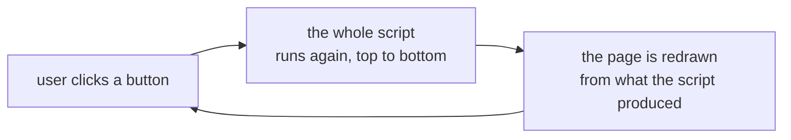
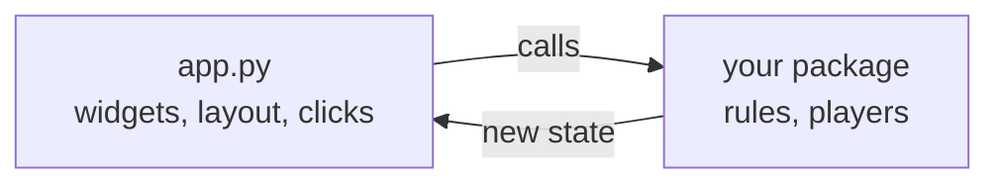

# Building the app

**Streamlit** turns a Python script into a web page. You call functions, it
renders widgets. There is no HTML to write, no JavaScript, no front-end build
step and no template language.

```console
$ pip install streamlit
$ streamlit run app.py
```

That opens a browser at `localhost:8501`. Save the file and the page reloads
itself — the edit-and-see loop is immediate, which is most of why Streamlit is
worth using.

!!! note "This repository does not ship a Streamlit app"
    NIM Arena's page is a [static site](../static-web/index.md). The code below
    is written against this project's public API so it stays concrete, but it
    is an illustration of the technique, not a file you will find in the
    repository.

---

## The one thing you must understand: the rerun

Streamlit has no callbacks, no component tree and no render function. Instead:

> **Every time the user interacts with anything, Streamlit runs your entire
> script again, from the first line to the last.**



Every confusing thing about Streamlit is a consequence of this, and every
Streamlit bug you will write is a rerun you did not expect. Two immediate
corollaries:

- **A plain local variable does not survive.** It is re-created from scratch on
  every interaction, so a game board kept in one resets on every click.
- **Expensive work is repeated.** Anything at the top of the script runs again
  on every click, including loading your player registry.

The fixes for those two are `st.session_state` and the cache decorators, below.
Learn those and Streamlit stops being surprising.

---

## Widgets

A widget call does two things at once: it draws the control, and it **returns
its current value** for this run.

```python
import streamlit as st

rows      = st.slider("Rows", min_value=1, max_value=5, value=3)
opponent  = st.selectbox("Opponent", ["random", "greedy", "hard"])
your_name = st.text_input("Your name", value="human")
go        = st.button("New game")        # True only on the run the click caused
```

`st.button` is the odd one: it returns `True` on the single rerun triggered by
the click and `False` on every other. So `if go:` is not "the button is
pressed", it is "the button was *just* pressed" — which is exactly what you
want for starting a game, and exactly wrong for remembering that a game is in
progress.

The rest of the vocabulary is small:

| Call | Draws |
| --- | --- |
| `st.write`, `st.markdown` | text, with Markdown |
| `st.slider`, `st.number_input` | a number |
| `st.selectbox`, `st.radio` | one choice from a list |
| `st.checkbox`, `st.toggle` | a boolean |
| `st.button` | a button |
| `st.dataframe`, `st.table` | a table |
| `st.success`, `st.error`, `st.warning`, `st.info` | a coloured message |

---

## Layout

Four containers cover almost everything:

```python
left, right = st.columns(2)          # side by side
with left:
    st.write("The board")
with right:
    st.write("The move log")

with st.sidebar:                     # the panel on the left
    st.selectbox("Opponent", names)

tab_play, tab_rules = st.tabs(["Play", "Rules"])
with tab_play:
    st.write("…")

box = st.container()                 # a handle you can write into later
```

For a board, `st.columns` is the honest answer: one column per stick, each with
a small button. It is not beautiful, but it is a working, clickable board in
four lines, and a working board beats a beautiful plan.

```python
for row, count in enumerate(state):
    cols = st.columns(max(state) or 1)
    for i in range(count):
        if cols[i].button("|", key=f"{row}-{i}"):
            play_move((row, count - i))
```

!!! warning "Every widget needs a unique `key` in a loop"
    Streamlit identifies a widget by its position and arguments. Two buttons
    created in a loop with the same label collide, and you get
    `DuplicateWidgetID`. Pass an explicit `key=` built from the loop variables,
    as above.

---

## Keeping state between reruns

`st.session_state` is a dictionary that survives reruns, one per browser
session. It is where the game lives.

```python
import streamlit as st
from nimarena import game
from nimarena.registry import REGISTRY

# Runs on every rerun, so guard the initialisation.
if "state" not in st.session_state:
    st.session_state.state = [3, 5, 7]
    st.session_state.history = []

def play_move(move):
    """Apply the human move, then let the bot answer."""
    st.session_state.state = game.apply_move(st.session_state.state, move)
    st.session_state.history.append(("human", move))

    if not game.is_terminal(st.session_state.state):
        bot_move = st.session_state.bot.choose_move(st.session_state.state)
        st.session_state.state = game.apply_move(st.session_state.state, bot_move)
        st.session_state.history.append(("bot", bot_move))
```

The `if "state" not in st.session_state` guard is the standard idiom. Without
it you reset the board on every click, which is the single most common
Streamlit bug there is.

!!! tip "Never trust a move you were handed"
    `game.apply_move` raises on an illegal move, and the web app is the one
    place where a user can invent one — a stale button, a double click, a
    hand-edited URL. Wrap the call and show `st.error(...)` instead of letting
    the page die with a stack trace. The engine stays strict; the app stays
    polite.

---

## Not repeating expensive work

Two decorators, and the difference between them matters:

```python
@st.cache_data                      # for values: results, dataframes, JSON
def load_leaderboard(path):
    return json.loads(Path(path).read_text())

@st.cache_resource                  # for objects: connections, registries, models
def load_registry():
    from nimarena.manifest import load_players
    return load_players(...)
```

`cache_data` returns a **copy** each time, so a caller cannot corrupt the cache.
`cache_resource` returns **the same object**, shared across sessions — right for
something expensive and read-only, wrong for anything holding per-game state.

Keep your `Player` instances *out* of `cache_resource`. A bot carries a seed and
sometimes a cache of its own; sharing one instance between two visitors makes
their games interfere. Build a fresh one per session with `Player.create(seed)`
and put it in `st.session_state`.

---

## The app is a shell

This is the part that matters for the project, not just for Streamlit.



`app.py` may contain: widget calls, layout, and the translation from a click to
a move. It may **not** contain: the rules, a win check, or a bot. Those live in
the package, which is also what the tests, the tournament and everyone else's
bots import.

The test is simple — if you deleted `app.py`, could you still play a full game
from a Python prompt? If not, logic has leaked into the interface.

---

## Project layout

```text
your-project/
├── src/yourgame/           the library: rules, players, API
├── app.py                  the Streamlit app, at the repository root
├── requirements.txt        what the *deployment* installs
├── pyproject.toml          what the *library* needs
└── tests/
```

`app.py` at the root is a convention, and
[Streamlit Community Cloud](cloud.md) will look for it there.

`requirements.txt` is not the same list as your `pyproject.toml` dependencies.
It is what the host installs to run the app, so it needs Streamlit *and* your
own package:

```text
streamlit>=1.36
git+https://github.com/<you>/<your-project>@main
```

Installing your own package from Git — rather than copying the source next to
`app.py` — is what keeps the "one source of truth" promise true in deployment
as well as on your laptop. See
[Installation and usage](../../python-library/installation-and-usage.md).

---

**Next:** [Streamlit Community Cloud](cloud.md) — putting it online.

**Also:** [API](../../python-library/api.md) · [Static web](../static-web/index.md)
