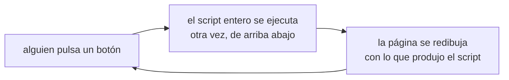
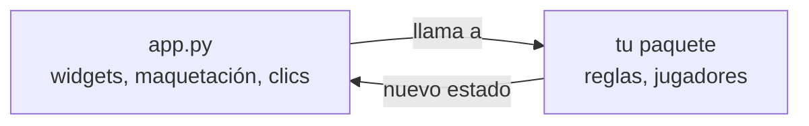

# Construir la aplicación

**Streamlit** convierte un script de Python en una página web. Tú llamas a
funciones, y él dibuja widgets. No hay HTML que escribir, ni JavaScript, ni
paso de compilación, ni lenguaje de plantillas.

```console
$ pip install streamlit
$ streamlit run app.py
```

Eso abre un navegador en `localhost:8501`. Guarda el archivo y la página se
recarga sola — el ciclo de editar y ver es inmediato, y esa es la mayor parte
de por qué merece la pena usar Streamlit.

!!! note "Este repositorio no tiene una aplicación Streamlit"
    La página de NIM Arena es un [sitio estático](../static-web/index.md). El
    código de abajo está escrito contra la API pública de este proyecto para
    que sea concreto, pero es una ilustración de la técnica, no un archivo que
    vayas a encontrar en el repositorio.

## Lo único que tienes que entender: la reejecución

Streamlit no tiene callbacks, ni árbol de componentes, ni función de renderizado.
En su lugar:

> **Cada vez que alguien interactúa con cualquier cosa, Streamlit ejecuta tu
> script entero otra vez, desde la primera línea hasta la última.**



Todo lo confuso de Streamlit es una consecuencia de esto, y todos los errores
que vas a cometer con Streamlit son una reejecución que no esperabas. Dos
corolarios inmediatos:

- **Una variable local normal no sobrevive.** Se vuelve a crear desde cero en
  cada interacción, así que un tablero guardado en una se reinicia con cada
  clic.
- **El trabajo caro se repite.** Todo lo que esté arriba del script se vuelve a
  ejecutar con cada clic, incluido cargar tu registro de jugadores.

Las soluciones a esas dos cosas son `st.session_state` y los decoradores de
caché, más abajo. Apréndetelos y Streamlit deja de sorprenderte.

## Widgets

La llamada a un widget hace dos cosas a la vez: dibuja el control y **devuelve
su valor actual** en esta ejecución.

```python
import streamlit as st

filas    = st.slider("Filas", min_value=1, max_value=5, value=3)
rival    = st.selectbox("Rival", ["random", "greedy", "hard"])
tu_nombre = st.text_input("Tu nombre", value="human")
empezar  = st.button("Nueva partida")   # True solo en la ejecución que causó el clic
```

`st.button` es el raro: devuelve `True` en la única reejecución que provocó el
clic y `False` en todas las demás. Así que `if empezar:` no es "el botón está
pulsado", es "el botón *acaba* de pulsarse" — que es justo lo que quieres para
empezar una partida, y justo lo contrario de lo que quieres para recordar que
hay una partida en curso.

El resto del vocabulario es corto:

| Llamada | Dibuja |
| --- | --- |
| `st.write`, `st.markdown` | texto, con Markdown |
| `st.slider`, `st.number_input` | un número |
| `st.selectbox`, `st.radio` | una opción de una lista |
| `st.checkbox`, `st.toggle` | un booleano |
| `st.button` | un botón |
| `st.dataframe`, `st.table` | una tabla |
| `st.success`, `st.error`, `st.warning`, `st.info` | un mensaje de color |

## Maquetación

Cuatro contenedores cubren casi todo:

```python
izq, der = st.columns(2)             # uno al lado del otro
with izq:
    st.write("El tablero")
with der:
    st.write("El registro de movimientos")

with st.sidebar:                     # el panel de la izquierda
    st.selectbox("Rival", nombres)

tab_jugar, tab_reglas = st.tabs(["Jugar", "Reglas"])
with tab_jugar:
    st.write("…")

caja = st.container()                # un hueco en el que escribir después
```

Para un tablero, `st.columns` es la respuesta honesta: una columna por palillo,
cada una con un botón pequeño. No es bonito, pero es un tablero clicable y
funcionando en cuatro líneas, y un tablero que funciona gana a un plan bonito.

```python
for fila, cuantos in enumerate(state):
    cols = st.columns(max(state) or 1)
    for i in range(cuantos):
        if cols[i].button("|", key=f"{fila}-{i}"):
            jugar_movimiento((fila, cuantos - i))
```

!!! warning "Cada widget dentro de un bucle necesita su propia `key`"
    Streamlit identifica un widget por su posición y sus argumentos. Dos
    botones creados en un bucle con la misma etiqueta chocan, y obtienes
    `DuplicateWidgetID`. Pasa una `key=` explícita construida con las variables
    del bucle, como arriba.

## Conservar el estado entre reejecuciones

`st.session_state` es un diccionario que sobrevive a las reejecuciones, uno por
sesión de navegador. Es donde vive la partida.

```python
import streamlit as st
from nimarena import game
from nimarena.registry import REGISTRY

# Se ejecuta en cada reejecución, así que protege la inicialización.
if "state" not in st.session_state:
    st.session_state.state = [3, 5, 7]
    st.session_state.history = []

def jugar_movimiento(move):
    """Aplica el movimiento humano y deja que responda el bot."""
    st.session_state.state = game.apply_move(st.session_state.state, move)
    st.session_state.history.append(("human", move))

    if not game.is_terminal(st.session_state.state):
        bot_move = st.session_state.bot.choose_move(st.session_state.state)
        st.session_state.state = game.apply_move(st.session_state.state, bot_move)
        st.session_state.history.append(("bot", bot_move))
```

El `if "state" not in st.session_state` es el idioma estándar. Sin él reinicias
el tablero en cada clic, que es el error más común que existe en Streamlit.

!!! tip "Nunca te fíes de un movimiento que te han dado"
    `game.apply_move` lanza una excepción con un movimiento ilegal, y la
    aplicación web es el único sitio donde alguien puede inventarse uno: un
    botón obsoleto, un doble clic, una URL editada a mano. Envuelve la llamada
    y muestra `st.error(...)` en lugar de dejar que la página muera con una
    traza. El motor sigue siendo estricto; la aplicación, educada.

## No repetir el trabajo caro

Dos decoradores, y la diferencia entre ellos importa:

```python
@st.cache_data                      # para valores: resultados, dataframes, JSON
def cargar_clasificacion(path):
    return json.loads(Path(path).read_text())

@st.cache_resource                  # para objetos: conexiones, registros, modelos
def cargar_registro():
    from nimarena.manifest import load_players
    return load_players(...)
```

`cache_data` devuelve una **copia** cada vez, así que quien la llame no puede
corromper la caché. `cache_resource` devuelve **el mismo objeto**, compartido
entre sesiones — correcto para algo caro y de solo lectura, incorrecto para
cualquier cosa que guarde estado de una partida.

Mantén tus instancias de `Player` *fuera* de `cache_resource`. Un bot lleva una
semilla y a veces una caché propia; compartir una instancia entre dos visitantes
hace que sus partidas interfieran. Construye una nueva por sesión con
`Player.create(seed)` y guárdala en `st.session_state`.

## La aplicación es una cáscara

Esta es la parte que importa para el proyecto, no solo para Streamlit.



`app.py` puede contener: llamadas a widgets, maquetación y la traducción de un
clic a un movimiento. **No** puede contener: las reglas, una comprobación de
victoria ni un bot. Eso vive en el paquete, que es también lo que importan los
tests, el torneo y los bots de los demás.

La prueba es sencilla: si borrases `app.py`, ¿podrías seguir jugando una
partida completa desde un prompt de Python? Si no, la lógica se ha filtrado a
la interfaz.

## Estructura del proyecto

```text
tu-proyecto/
├── src/tujuego/            la librería: reglas, jugadores, API
├── app.py                  la aplicación Streamlit, en la raíz
├── requirements.txt        lo que instala el *despliegue*
├── pyproject.toml          lo que necesita la *librería*
└── tests/
```

`app.py` en la raíz es una convención, y
[Streamlit Community Cloud](cloud.md) lo buscará ahí.

`requirements.txt` no es la misma lista que las dependencias de tu
`pyproject.toml`. Es lo que el servicio instala para ejecutar la aplicación, así
que necesita Streamlit *y* tu propio paquete:

```text
streamlit>=1.36
git+https://github.com/<tu-usuario>/<tu-proyecto>@main
```

Instalar tu propio paquete desde Git —en lugar de copiar el código junto a
`app.py`— es lo que mantiene cierta la promesa de "una sola fuente de verdad"
también en el despliegue, y no solo en tu portátil. Mira
[Instalación y uso](../../python-library/installation-and-usage.md).

## Adónde ir después

- [Streamlit Community Cloud](cloud.md) — ponerla en línea.
- [API](../../python-library/api.md) — diseñar el paquete al que llama esta
  aplicación.
- [Web estática](../static-web/index.md) — la otra ruta, sin servidor.
